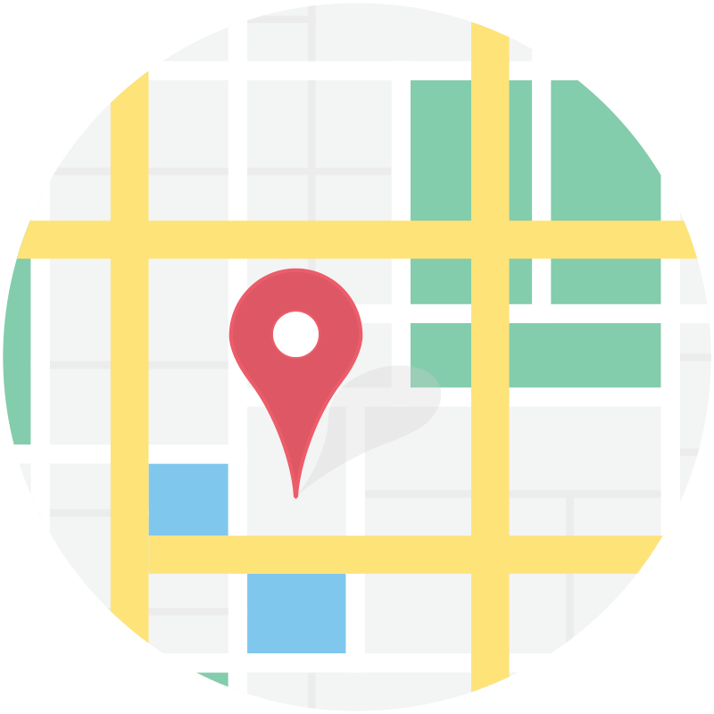
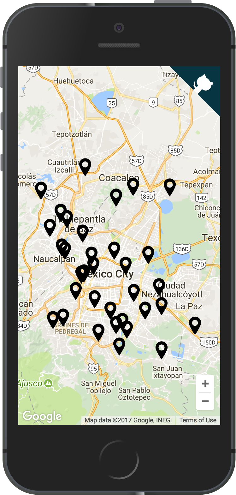
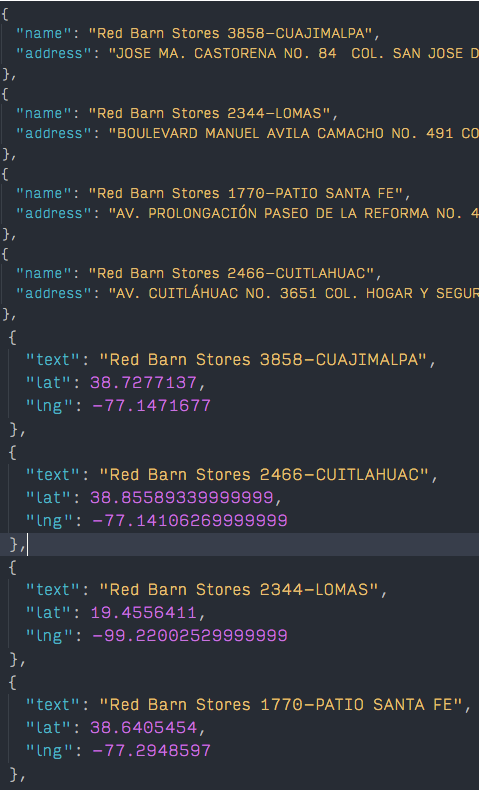

# React MX Maps



Used React, Node, and Google Maps API's. We are given a list of ~250 ambiguous addresses to render in a map. 

## Table of Contents
- [User Stories](#stories)
- [Screenshots](#screenshots)
- [Walkthrough](#walkthrough)
  - [Loading the API](#first)
  - [Rendering the map](#second)
  - [Geocoding the markers](#third)
  - [Rendering the markers](#fourth)
- [Prerequisites](#prerequisites)

## User Stories
<div id='stories'/>

- [x] As a student, I want to see a map of Mexico City.
- [x] As a student, I want to see a map that has all the stores represented as markers/pins on the map.

## Screenshots
<div id='screenshots'/>




## Walkthrough
<div id='walkthrough'/>

### First step: loading the Google Maps API
<div id='first'/>

To load the [Maps API library][maps browser] on web clients only a script tag is provided, with an optional callback. We need to expose a "google" global variable. To make sure this variable will be available in our code the script can be loaded in head, but this blocks html parsing until it finishes executing. Alternatively we use its optional callback to call a global function of our own, escaping the React flow.

A variety of approaches (see [FullStackReact] in depth one) can be followed to load the script asynchronously, while making sure not to execute code before the global variable is available. In this case [google-map-react], handles the loading of the script asynchronously. We pass the apiKey inside a bootstrapURLKeys prop.

If you are loading the script directly from html, make sure to async and defer the request to assure html parsing is not interrupted until the script finishes downloading and executing.

### Second step: rendering the map in React
<div id='second'/>

The Google Maps API renders the map on the DOM itself. Just like React, a reference to a div must be passed along for the API to take control of.
React runs into issues when another library manipulates the same sections of the DOM directly, which is also why you shouldn't use jQuery with React.

An additional layer should be used to isolate the DOM manipulation of the Maps API from React. I tried [google-maps-react] and [react-google-maps], but unfortunately could not get either one working.

A more minimal library was used instead: [google-map-react]. This library provides a component to render the map in, and accepts children components of any kind as Markers.
This is exactly all we need for these user stories, but if we wanted more advanced features from the Google API one of the former two libraries would be a better choice.

### ~~Third step: rendering the markers~~

Not so fast, first we need their coordinates.

### Third step: geocoding the markers
<div id='third'/>

Because of the amount of markers (~250), I decided to do this beforehand in the server, and persist the results for the client to just consume. I wrote a nodejs script to achieve this, using Maps [node library][maps node].

The list of addresses provided cannot be reliably geocoded by just [Google Geocode][geocode] service, and even manual queries on maps.google.com fail. Because of this I needed some additional steps to obtain less than ideal, but useable data:

1. Addresses are passed first to [Place Autocomplete][autocomplete] service. This service takes an ambiguous address, and tries to predict an unambiguous placeId identifying a precise location. It takes into account businesses, points of interest, and some typos.
2. If [Place Autocomplete][autocomplete] was succesful, we send the placeId to [Place Details][details] service ([Geocode][geocode] service does not accept placeId's in the node library), which between its results always returns an unambiguous location object {lat, lng}.

This is the approach google recommends for [automated systems processing ambiguous queries][best practices]. While I noticed a noticeable increase in matches, I was still left with only a tiny fraction of matched markers. A third step was needed.

3. Each address is run multiple times through the services, each time trimming more of it from the end. This has the effect of making the address more general, increasing our chances of finding a match.

This is a rather crude and unprecise method, but it allowed me to get some kind of coordinates for ~98% of the markers. In a real application, similar but more sofisticated approaches can be used to increase both the accuracy, and the efficacy of our predictions. Two possible examples:

- [x] [Place Autocomplete][autocomplete] service allows you to set strict or lax boundaries in which to request the predictions. In our case by setting these boundaries to Mexico City we would cut a lot of the current noise and inacuraccy we are getting. (Included in last commit)
- [ ] We can parse the address to make our trimming more intelligent. [Query Autocomplete][query] service can helps us with this, by giving us substrings and matched terms of an address query.

### Fourth step: rendering the markers
<div id='fourth'/>

[google-map-react] lets us render our own components as map marker. Consideration was taken into not lifting state too much, leaving it in <Map />, to allow for <App /> to handle layout and shared state (favorite markers).


## Prerequisites
<div id='prerequisites'/>

An environment variable ```REACT_APP_GAPI_KEY``` must be provided with a valid Google Maps API key.
It took a few thousand requests to parse the ~250 addresses, and a free account limits you to 1000 requests a day. You can either [enable billing][quota] or run it in batches.

Node 8.x must be installed globally for the parser script to run. This project currently uses [create-react-app], this gives us absolute import paths, environment variables, and an already optimized webpack config.

- `$ yarn install` installs all the necessary dependencies.
- `$ yarn start` will run the app in a development server.
- `$ yarn parse` runs the node script to geocode our dataset.


[google-maps-react]: https://github.com/fullstackreact/google-maps-react
[google-map-react]: https://github.com/istarkov/google-map-react
[react-google-maps]: https://github.com/tomchentw/react-google-maps
[FullStackReact]: https://gist.github.com/auser/1d55aa3897f15d17caf21dc39b85b663(
[create-react-app]: https://github.com/facebookincubator/create-react-app
[best practices]: https://developers.google.com/maps/documentation/geocoding/best-practices
[autocomplete]: https://developers.google.com/places/web-service/autocomplete
[query]: https://developers.google.com/places/web-service/query
[details]: https://developers.google.com/places/web-service/details
[maps node]: https://github.com/googlemaps/google-maps-services-js
[quota]: https://developers.google.com/places/web-service/usage
[geocode]: https://developers.google.com/maps/documentation/geocoding/start
[maps browser]: https://developers.google.com/maps/documentation/javascript/tutorial
